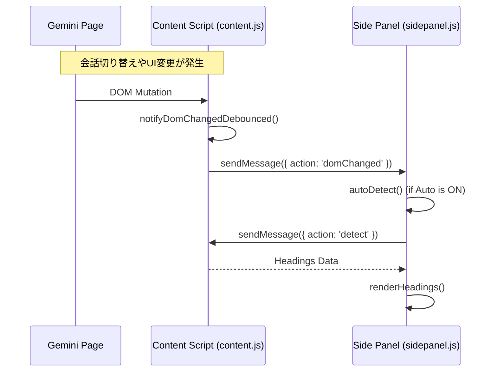

# Walkthrough - Fix Side Panel Auto-Update

Geminiの会話切り替え時にサイドパネルの目次が更新されない問題を修正しました。

## 変更内容

### [Side Panel]

#### [sidepanel.js](file:///Users/user/agy_project/geminavi_bmt_ext/extension/sidepanel.js)
- **`domChanged` メッセージリスナーの追加**:
  コンテンツスクリプト（`content.js`）から送信される `domChanged` メッセージを受信し、自動更新が有効な場合に `autoDetect()` を実行して目次を再描画するようにしました。
- **ポーリングロジックの廃止**:
  以前は 1秒ごとに `checkForChanges` というメッセージを（未実装の機能に向けて）送り続けていましたが、これを廃止し、メッセージベースの効率的な更新フローに一本化しました。

## 修正の仕組み

## 検証方法

1.  **コードレビュー**: `sidepanel.js` に `domChanged` のリスナーが正しく追加され、ポーリングが停止していることを確認。
2.  **既存機能への影響**: インページパネル（`panel.js`）は独自のオブザーバーを使用しているため、この変更による影響を受けないことを確認。

> [!NOTE]
> この修正により、Geminiのチャットペインで別の会話を選択した際、サイドパネルが即座に反応して目次を更新するようになります。
